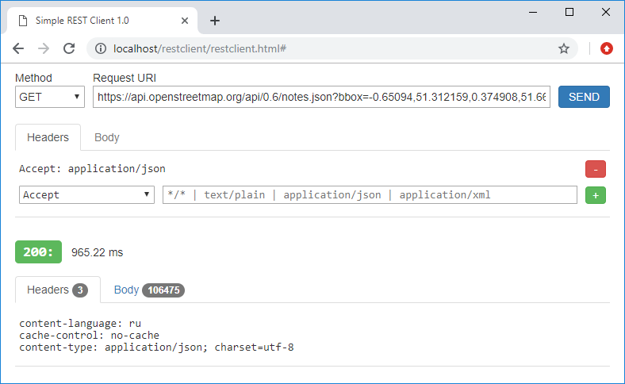
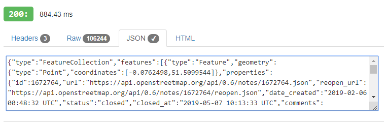

# RESTClient

A simple web-based REST Client that was specially designed for testing API of REST-services. 
Just look at screenshot below.

In this example, the client requests some geo-information from the OpenStreetMap service by 
sending to it a GET request with a custom Accept header.

### Versions

#### v.1.0 

The first released version.

#### v.1.1

**ADDED:**
 * tab to veiw the response body as **JSON**
 * tab to veiw the response body as **HTML**

And now the previous example looks like follows.

**FIXED:**
 * a bug related to the request body

