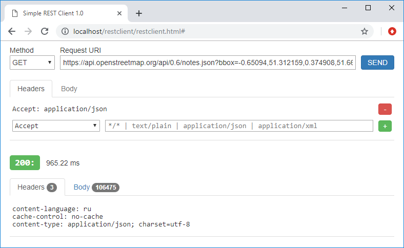

# RESTClient

A simple web-based REST Client was specially designed for testing API of REST-services. Just look at screenshot below.

In this example, the client requests some geo-information from the OpenStreetMap service by sending it a GET request 
with a custom Accept header.